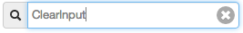

ClearInput Backbone component
=============================

`Backbone.View` component to clear the content of an input field.
Bring your own input element!



How to use?
-----------
For an example on how to use this, open the `./example/index.html` in your browser (browser must be able to make XHR requests, i.e. Chrome, Firefox or you must create a server at the root of the directory).

### html structure
You need to wrap the input field that needs the clear input button with an element of class `.clear-button-container`.

### CSS
The basic CSS to make the clear input button work is in `style.css`. To set the width/height of the input field, make sure you apply the height/width to the `.clear-button-container`.

### JavaScript
```javascript
var inputElement = document.getElementsByTagName('input')[0];

var clearInput = new ClearInput({
    // inputElement is the DOM Input element that should
    // have clearInput button applied
    input: inputElement
});

// OR:

var clearInput = new ClearInput();
clearInput.setInputElement(inputElement);


// The `clearInput` view takes care of clearing the `input` view,
// hiding and showing itself. 
// If you need to hook into the action (i.e. you need to update
//another part of the page, make an XHR, etc, you can listen for
// the `clear` event, i.e.

clearInput.on('clear', function () {
    // whatever you need to do
});

// if you're using backbone >= 0.9.9, you should can use the
// `#listenTo()` method, to get automatic clean up of your view:

this.listenTo(clearInput, 'clear', function () {
    // whatever you need to do
});

```

dependencies
------------
For dependency details: `component.json`

to install (for dev)
--------------------
dependencies: node.js, npm, bower.js & PhantomJS (for testing)

```bash
cd component-clearInput
npm install # installs test dependencies and client-side dependencies
```

to test
-------
```bash
npm test
```
